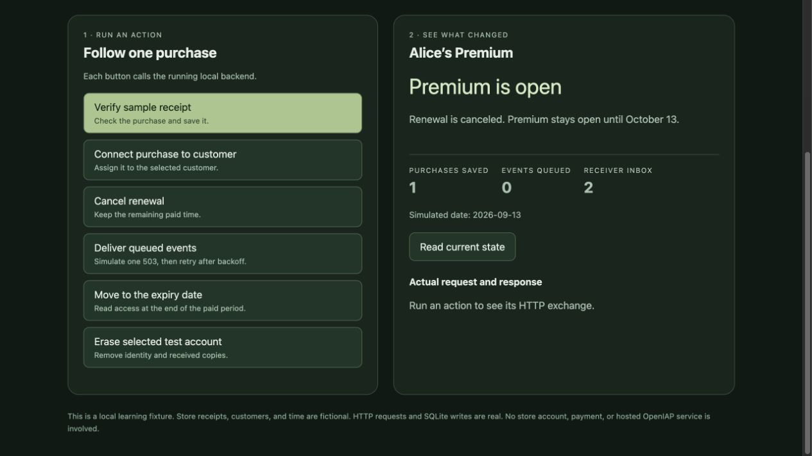

# Commerce Protocol: built with AI from an empty folder

Run a local Premium purchase backend, then follow the commits that built it.
The AI read the published contract, wrote the implementation, ran the tests,
and corrected a conformance failure. Each milestone preserves its real output
and screenshot. No previous example runtime was copied into this project.

## Try the result

Install Bun (tested with 1.3.13) and Node.js/npm, then run:

```sh
git clone --branch codex/commerce-protocol-from-scratch --single-branch https://github.com/hyodotdev/openiap-commerce-protocol-example.git
cd openiap-commerce-protocol-example
npm ci
npm test
npm start
```

Open `http://127.0.0.1:5196`. **Verify → connect Alice → cancel renewal → deliver
→ expire → deliver → erase.** Select Bob after connecting Alice and try to
claim her purchase: Bob stays locked. Expand the HTTP exchange to see exactly
which API was called and what it returned.

Restarting keeps the SQLite databases in `.runtime/`. For a fresh demo, use a
fresh checkout. `PORT=5197 npm start` selects another port. No payment, account,
server key, or cloud service setup is needed: every credential is a local fixture.



## Follow the build

Start with [the exact AI input](evidence/ai-input.md): the CLI output, the
rendered documentation request, and the user's fresh-history constraints.
`init` printed instructions and exited with no project changes. The AI wrote
all application code afterward, with tests and corrections across these commits.

| Commit                | Visible result                                            | Inspect the actual checkpoint                                                                                                                                                                                                                                                                                                                                                                                                                                                                                                                     |
| --------------------- | --------------------------------------------------------- | ------------------------------------------------------------------------------------------------------------------------------------------------------------------------------------------------------------------------------------------------------------------------------------------------------------------------------------------------------------------------------------------------------------------------------------------------------------------------------------------------------------------------------------------------- |
| 0. Initial input      | CLI prints a brief; no application source exists.         | [Code](https://github.com/hyodotdev/openiap-commerce-protocol-example/tree/39cdad22713cae5cfa864ce63f4a69c933c51990) · [Diff](https://github.com/hyodotdev/openiap-commerce-protocol-example/commit/39cdad22713cae5cfa864ce63f4a69c933c51990) · [Run](https://github.com/hyodotdev/openiap-commerce-protocol-example/blob/39cdad22713cae5cfa864ce63f4a69c933c51990/evidence/00-install.json)                                                                                                                                                      |
| 1. Start the server   | HTTP and an empty SQLite database run.                    | [Code](https://github.com/hyodotdev/openiap-commerce-protocol-example/tree/e4b92680c746eee9abecb4da290499d89f118cbd) · [Diff](https://github.com/hyodotdev/openiap-commerce-protocol-example/commit/e4b92680c746eee9abecb4da290499d89f118cbd) · [Run](https://github.com/hyodotdev/openiap-commerce-protocol-example/blob/e4b92680c746eee9abecb4da290499d89f118cbd/evidence/01-server.json) · [Screen](https://github.com/hyodotdev/openiap-commerce-protocol-example/blob/e4b92680c746eee9abecb4da290499d89f118cbd/evidence/01-screen.png)       |
| 2. Verify a receipt   | One purchase is saved; no customer owns it.               | [Code](https://github.com/hyodotdev/openiap-commerce-protocol-example/tree/e77b493699bb95b5b8be203135b68484c4b4a92d) · [Diff](https://github.com/hyodotdev/openiap-commerce-protocol-example/commit/e77b493699bb95b5b8be203135b68484c4b4a92d) · [Run](https://github.com/hyodotdev/openiap-commerce-protocol-example/blob/e77b493699bb95b5b8be203135b68484c4b4a92d/evidence/02-verification.json) · [Screen](https://github.com/hyodotdev/openiap-commerce-protocol-example/blob/e77b493699bb95b5b8be203135b68484c4b4a92d/evidence/02-screen.png) |
| 3. Connect Alice      | Alice gets Premium; Bob cannot take the purchase.         | [Code](https://github.com/hyodotdev/openiap-commerce-protocol-example/tree/6161977a9c79612297c859f414ff366aeebcd0be) · [Diff](https://github.com/hyodotdev/openiap-commerce-protocol-example/commit/6161977a9c79612297c859f414ff366aeebcd0be) · [Run](https://github.com/hyodotdev/openiap-commerce-protocol-example/blob/6161977a9c79612297c859f414ff366aeebcd0be/evidence/03-ownership.json) · [Screen](https://github.com/hyodotdev/openiap-commerce-protocol-example/blob/6161977a9c79612297c859f414ff366aeebcd0be/evidence/03-screen.png)    |
| 4. Cancel renewal     | Paid access stays open; the change is queued.             | [Code](https://github.com/hyodotdev/openiap-commerce-protocol-example/tree/18fcf40579b9161d3ff629574f896be5eeca1151) · [Diff](https://github.com/hyodotdev/openiap-commerce-protocol-example/commit/18fcf40579b9161d3ff629574f896be5eeca1151) · [Run](https://github.com/hyodotdev/openiap-commerce-protocol-example/blob/18fcf40579b9161d3ff629574f896be5eeca1151/evidence/04-lifecycle.json) · [Screen](https://github.com/hyodotdev/openiap-commerce-protocol-example/blob/18fcf40579b9161d3ff629574f896be5eeca1151/evidence/04-screen.png)    |
| 5. Deliver events     | 503 is retried; the receiver saves one copy.              | [Code](https://github.com/hyodotdev/openiap-commerce-protocol-example/tree/d1d9a96432624af8369560188c31af334da526d5) · [Diff](https://github.com/hyodotdev/openiap-commerce-protocol-example/commit/d1d9a96432624af8369560188c31af334da526d5) · [Run](https://github.com/hyodotdev/openiap-commerce-protocol-example/blob/d1d9a96432624af8369560188c31af334da526d5/evidence/05-delivery.json) · [Screen](https://github.com/hyodotdev/openiap-commerce-protocol-example/blob/d1d9a96432624af8369560188c31af334da526d5/evidence/05-screen.png)     |
| 6. Expire and restart | Access closes on time; state survives process restart.    | [Code](https://github.com/hyodotdev/openiap-commerce-protocol-example/tree/e697873b605e4b529e9d743d8f090c8935f1e560) · [Diff](https://github.com/hyodotdev/openiap-commerce-protocol-example/commit/e697873b605e4b529e9d743d8f090c8935f1e560) · [Run](https://github.com/hyodotdev/openiap-commerce-protocol-example/blob/e697873b605e4b529e9d743d8f090c8935f1e560/evidence/06-recovery.json) · [Screen](https://github.com/hyodotdev/openiap-commerce-protocol-example/blob/e697873b605e4b529e9d743d8f090c8935f1e560/evidence/06-screen.png)     |
| 7. Erase the account  | Identity is removed; late requests cannot restore access. | [Code](https://github.com/hyodotdev/openiap-commerce-protocol-example/tree/e7bd417e80723e9cad3991f5648f2cb6803f3796) · [Diff](https://github.com/hyodotdev/openiap-commerce-protocol-example/commit/e7bd417e80723e9cad3991f5648f2cb6803f3796) · [Run](https://github.com/hyodotdev/openiap-commerce-protocol-example/blob/e7bd417e80723e9cad3991f5648f2cb6803f3796/evidence/07-final.json) · [Screen](https://github.com/hyodotdev/openiap-commerce-protocol-example/blob/e7bd417e80723e9cad3991f5648f2cb6803f3796/evidence/07-screen.png)        |

Each commit was then independently extracted, installed, and tested again:
[clean-checkout replay](evidence/history-replay.json). Run `node verify-history.mjs`
to repeat the replay. [Implementation notes](BUILD-NOTES.md) explain the API and
storage changes in each milestone.

## What the verification proves

- Local HTTP, SQLite persistence, ownership, cancellation, expiry, delivery,
  abrupt process restart, and erasure run against the new implementation.
- The published REST runner passes for the declared verification, entitlements,
  and accountLifecycle profiles using fictional store evidence. The initial
  [failed run](evidence/07-first-conformance.json) and
  [failing source patch](evidence/07-first-attempt.patch) are retained.
- Two **intentional negative controls** break the ownership guard or expiry
  boundary in disposable copies. The tests fail in both cases:
  [ownership](evidence/negative-ownership-guard.json),
  [expiry](evidence/negative-expiry-boundary.json).
- [Comparison with the earlier example and IAPKit](evidence/comparison.md)
  records what was run and what was only read.

Store receipts, Alice/Bob sessions, the clock, and Google-shaped tokens are
fixtures. This does not verify a real store purchase, native SDK checkout,
Nami integration, revenue reporting, or deployment. Loopback delivery is a local
exception; the production events profile and GraphQL are not claimed.

This is an iterative implementation by the same AI with prior conversation
context. It is not an independent model trial or proof that one prompt always
succeeds. The earlier prototype's history remains separate from this new root.
